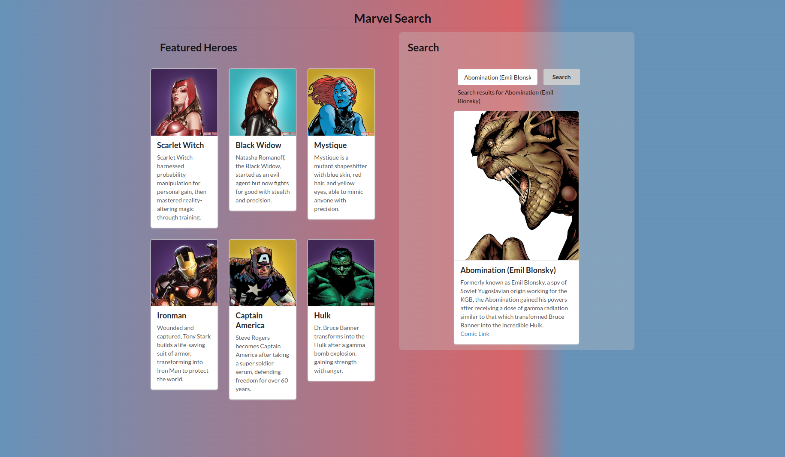

# Marvel Search 

With Marvel Search you can easily search into the Marvel APi for the characters provided by it.



## Description

The application is a React app using Semantic UI. The search app is retrieving information from Marvel API.
The application is developed for learning purposes.
During this project I learned more about:
* Using API:s and more specifically the Marvel API
* Creating md-5 hash key
* Semantic UI
* More understanding about fetching data and rendering it in React
* React application in general
* React hooks
* Website accessibility

## Getting Started

### Marvel API
Get you own developer keys for using the API on [Marvel developer site](https://developer.marvel.com/)
Go to [password generator website](https://passwordsgenerator.net/md5-hash-generator/)
, enter your strings like 1564731162583abcd1234 (timestamp + private key + api key without spaces) 
and generate you md-5 hash.

### Dependencies

* Node and npm
* React
* Semantic UI

### Installing

Use npm install. You can learn more in the
[Create React App documentation](https://facebook.github.io/create-react-app/docs/getting-started).

### Executing program

Runs the app in the development mode.\
Open [http://localhost:3000](http://localhost:3000) to view it in your browser.

The page will reload when you make changes.\
You may also see any lint errors in the console.
```
npm start
```

Builds the app for production to the `build` folder.\
It correctly bundles React in production mode and optimizes the build for the best performance.
```
npm run build
```

## Authors

This repository is written by and belongs to Katarina Lejonlid.


## Acknowledgments

Inspiration, code snippets, etc.
* [Marvel developer site](https://developer.marvel.com/)